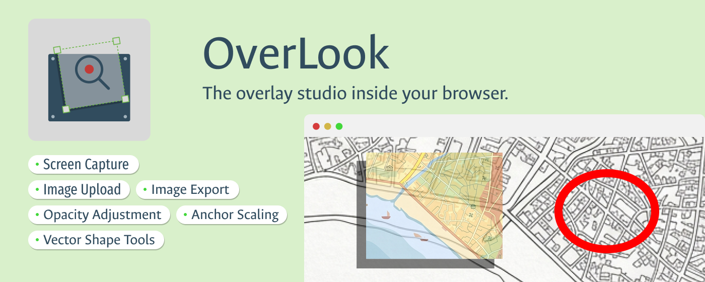
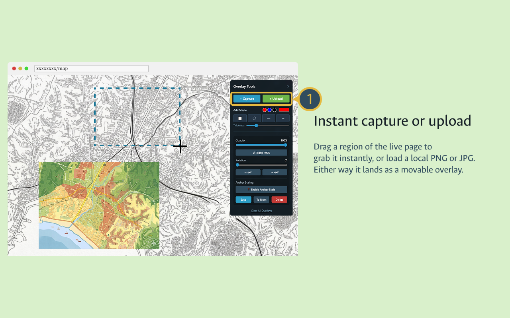
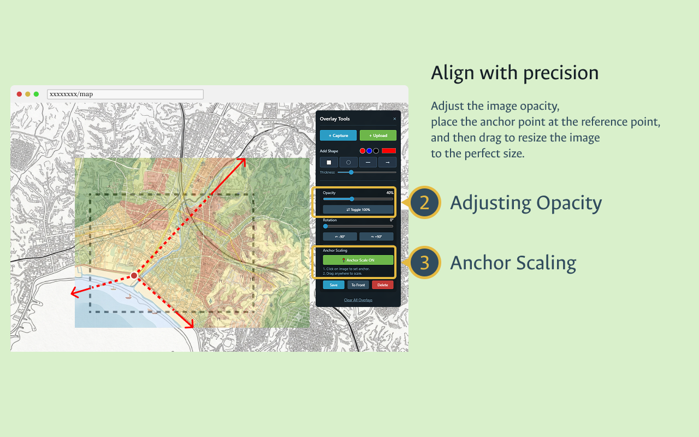
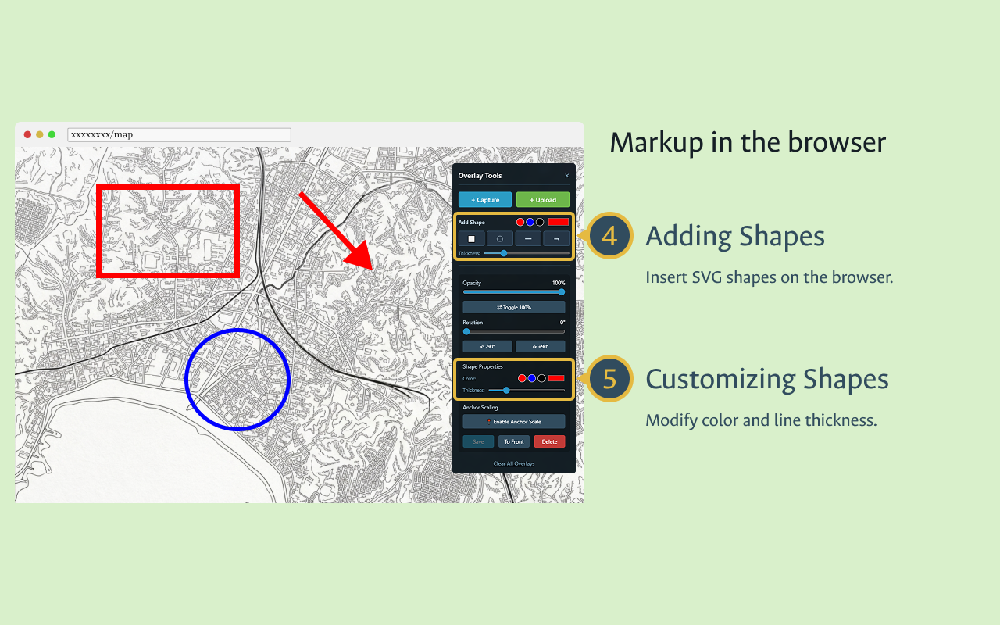

# OverLook

**The overlay studio inside your browser.**

OverLook is a Chrome extension that lets you capture any region of the screen or upload a local image and display it as a movable, resizable overlay on top of any web page — without leaving the browser.

---

## ✨ Features

### 📸 Capture & Upload
- **Screen Capture** — Click `+ Capture`, drag to select any region of the live page, and it instantly becomes an overlay. Retina / high-DPI displays are handled automatically.
- **Image Upload** — Click `+ Upload` to load a local PNG, JPG, or any browser-supported image. Images larger than 50% of the viewport are scaled down automatically.
- **Export as PNG** — Select any overlay and click **Save** to download it as a timestamped PNG file.

### 🔷 Shape Annotation
- **Draw shapes** directly on the page: rectangle, circle, line, or arrow — all rendered as crisp SVG.
- **Color presets** (red / blue / black) plus a custom color picker for any shade.
- **Stroke thickness** slider (1–20 px); arrows also have a separate **head size** slider (1–50).
- Shapes can be selected and edited after placement just like image overlays.

### 🖱️ Transform
- **Drag** any overlay freely across the page.
- **Resize** with four corner handles. Hold **Shift** to lock the aspect ratio.
- **Rotate** with a 0–360° slider, or snap in 90° steps with the `±90°` buttons.
- Rotation-aware resize math keeps corners anchored correctly at any angle.

### 🌗 Opacity
- **Opacity slider** (0–100%) with a live percentage readout.
- **Toggle button** — instantly flip between 100% opacity and your last-set value. Useful for quick before/after comparisons.

### 📍 Anchor Scaling
Precisely align an overlay to a reference point on the page, then scale it from that anchor:

1. Click **Enable Anchor Scale** — the cursor becomes a crosshair.
2. Click a point on the overlay to plant the anchor (marked with a red dot).
3. Drag anywhere to scale the overlay proportionally around that fixed point.

### 🗂️ Layer Management
- Keep as many overlays on screen simultaneously as you need.
- Click any overlay to select it; it gets a blue border and resize handles.
- **To Front** brings the selected overlay to the top of the z-stack.
- **Delete** removes the selected overlay (with confirmation).
- **Clear All Overlays** removes everything at once.

### 💾 Persistent State
Overlays are saved automatically to `chrome.storage.local` and restored when you revisit the same page. Each URL (origin + path) has its own independent overlay set.

### 🔒 Privacy
- No data collection, no telemetry, no analytics.
- All processing is 100% local — nothing leaves your browser.
- No account, login, or network access required.
- No third-party libraries.

---

## 🖼️ Screenshots

| | | |
|:---:|:---:|:---:|
|  |  |  |
| **Instant capture or upload** — drag a region or load a file | **Align with precision** — adjust opacity, set an anchor, then drag to scale | **Markup in the browser** — add and customize SVG shapes |

---

## 📦 Installation

### Chrome Web Store
*(Coming soon — link will be added when the listing is live.)*

### 🛠️ Developer Mode (manual)
1. Clone or download this repository.
2. Open Chrome and go to `chrome://extensions`.
3. Enable **Developer mode** (toggle in the top-right corner).
4. Click **Load unpacked** and select the folder that contains `manifest.json`.

---

## 🚀 Usage

1. **Open the panel** — click the OverLook icon in the Chrome toolbar. The **Overlay Tools** panel appears in the top-right corner of the page.

2. **Add an overlay**
   - **Capture**: click `+ Capture`, then drag a rectangle over the area you want. Release to create the overlay.
   - **Upload**: click `+ Upload` and pick a local image file.

3. **Add shapes** — choose a color and thickness in the **Add Shape** section, then click a shape button (⬜ ◯ ━ ➞). The shape appears centered on the page.

4. **Select and adjust** — click any overlay to select it, then:
   - Drag to **move**.
   - Drag a corner handle to **resize** (hold **Shift** to lock aspect ratio).
   - Use the **Opacity** slider or toggle button to control transparency.
   - Use the **Rotation** slider or ±90° buttons to rotate.
   - For shapes, edit **Color** and **Thickness** in the Shape Properties section.

5. **Anchor Scaling** — click **Enable Anchor Scale**, click a reference point on the overlay, then drag to scale from that anchor.

6. **Layer order** — select an overlay and click **To Front** to bring it above others.

7. **Save** — select an overlay and click **Save** to export it as a PNG.

8. **Close** — click × on the panel. If overlays are on screen, you will be asked whether to keep them or delete them.
